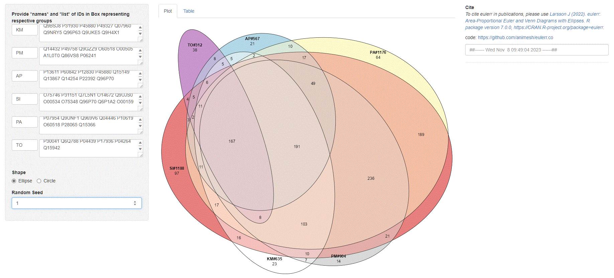

# eulerr.co

This is the github repository for the shiny application built with 
the R package [eulerr](https://CRAN.R-project.org/package=eulerr)
that is hosted at [venn](https://fuzzylife.shinyapps.io/venn/) for 
creating venn diagrams by providing list of IDs (upto 6 groups).

